# School District Analysis

## Overview
The Py City Schools school board has identified evidence of academic dishonesty in the student data for Thomas High School (THS).  Specifically, the reading and math scores for THS ninth grade appear to have been altered.  This analysis generates a full set of school district metrics with the scores for THS ninth grade reading and math removed.  These metrics will be compared to the previously generated metrics that contain all of the scores to determine how removing the ninth grade scores affected the analysis.

## Resources
- Source Data:  [schools_complete.csv](./resources/schools_complete.csv)
- Source Data:  [students_complete.csv](./resources/students_complete.csv)
- Analysis Notebook:  [PyCitySchools_Challenge.ipynb](./PyCitySchools_Challenge.ipynb)
- Tools Used:  Python 3.7, Anaconda 4.10, Jupyter Notebook 6.3

## Analysis Results
The following describe how the analysis was impacted by removing the THS ninth grade reading and math scores from the dataset.
- Affect on district summary

There was not a substantial impact on the district summary, as is shown below.  The first image is before removing THS ninth grade, the second is after.  The only impact large enough to show change when using the required significant digits in the percentages is the average math score, which was reduced by 1/10th of a percent when the THS ninth grade scores are removed.

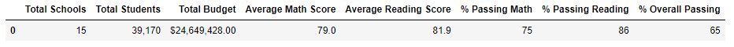 
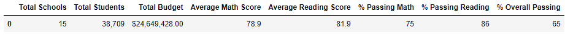

- Affect on THS school summary

The THS school summaries for the top 3 schools, sorted by % Overall Passing, are shown below.  The first summary is before removing the ninth grade scores and the second is after removing the ninth grade scores.  With the ninth grade reading and math scores removed all of the averages and % passing metrics are reduced by 0.5% or less.

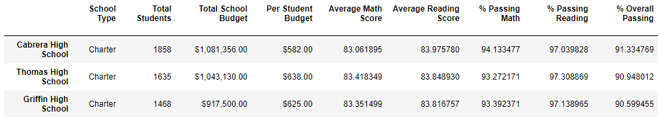 

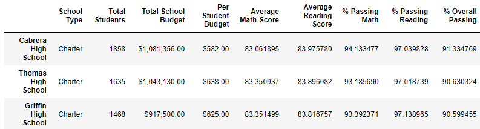

- Affect on THS performance relative to other schools

After removing the ninth grade scores THS still holds second place in the top 3 schools, as shown in the images above.

- Affect on math and reading scores summarized by:
    - Grade level:  The only change to the grade level metrics is the removal of all ninth grade scores for reading and math as shown below.  The first image pair is math, the second is reading.  The data on the left is prior to removal of the ninth grade scores and the data on the right is after the ninth grade scores were removed.

    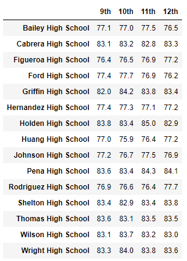 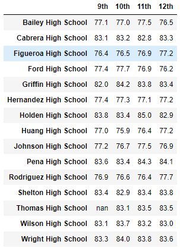

    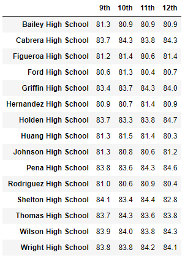 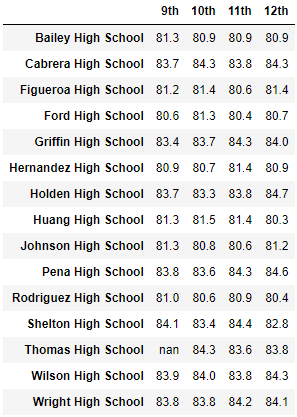

    - School spending:  removal of the THS ninth grade scores has no impact on the district summary by spending.
    
    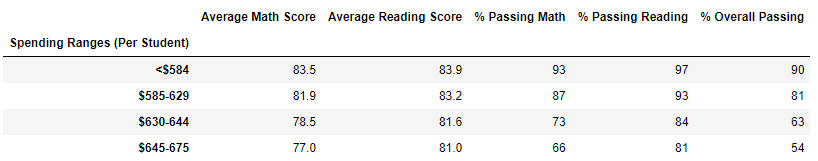 
    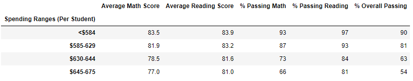

    - School size:  removal of the THS ninth grade scores has no impact on the district summary by school size.

    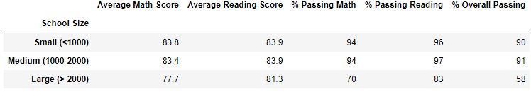 
    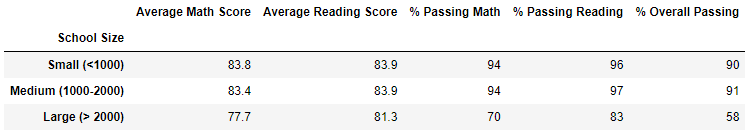

    - School type (charter or district):  removal of the THS ninth grade scores has no impact on the district summary by school type.

    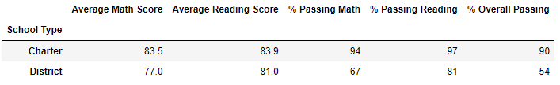 
    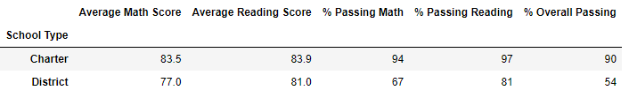

## Analysis Summary
Removing the THS ninth grade scores from the analysis resulted in the following changes in the metrics:
- The average math score for the district was reduced by 0.1%
- The average math score for THS was reduced by less than 0.1%
- The average reading score for THS was increased by 0.05%
- The % math and overall passing for THS were reduced by 0.1% and 0.3%, respectively
